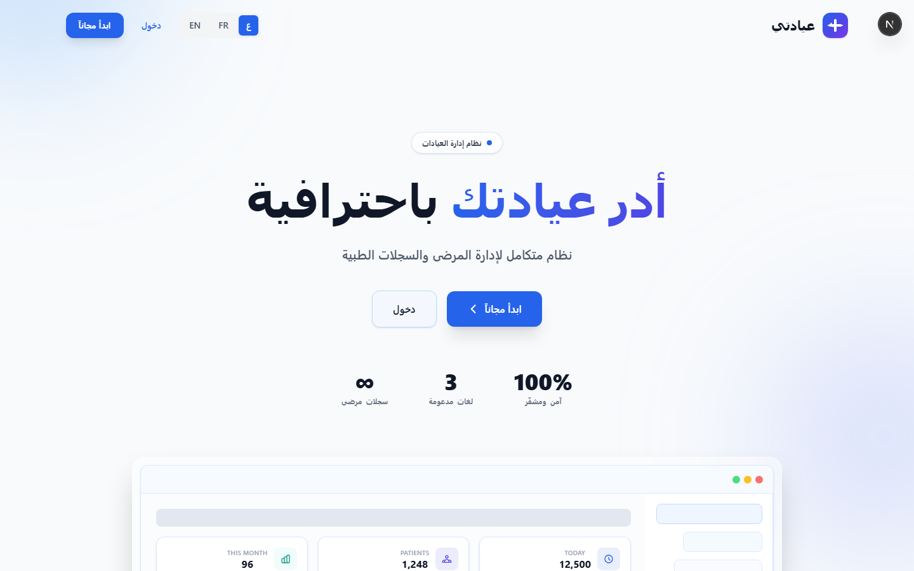
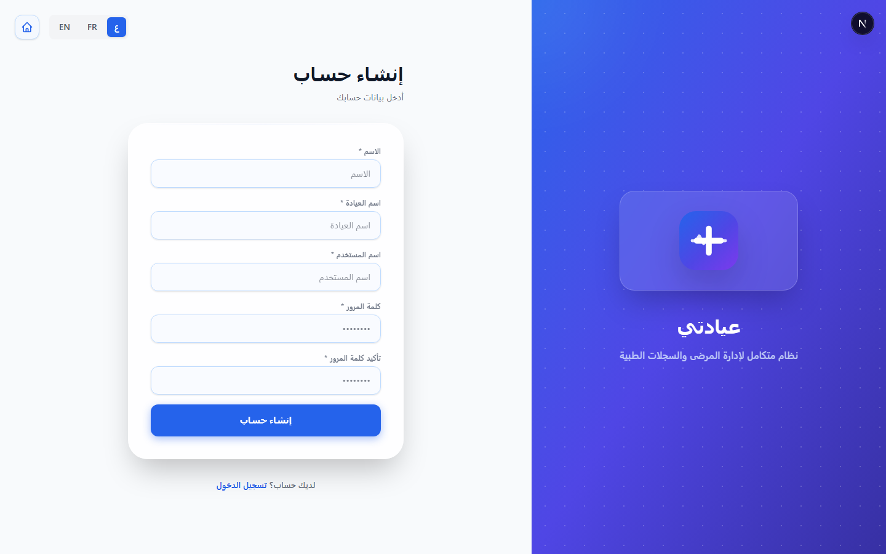
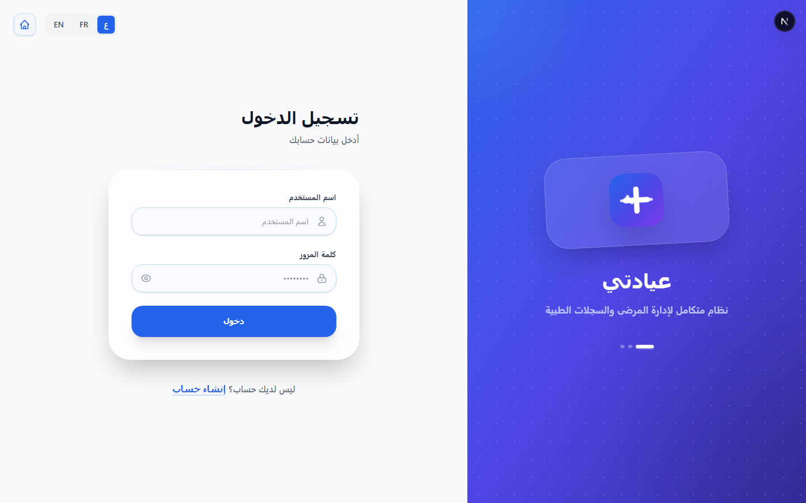
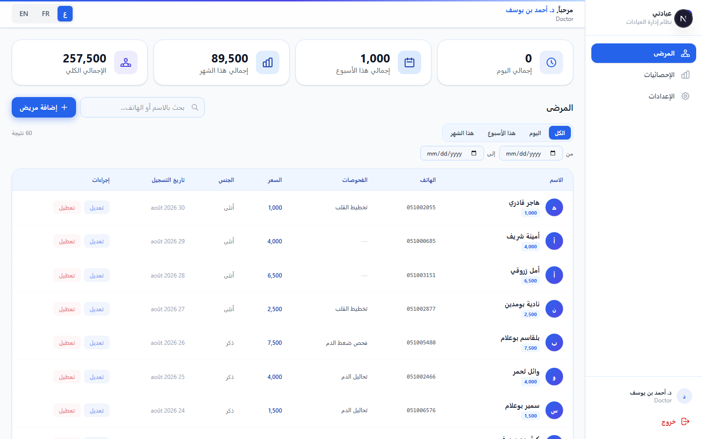
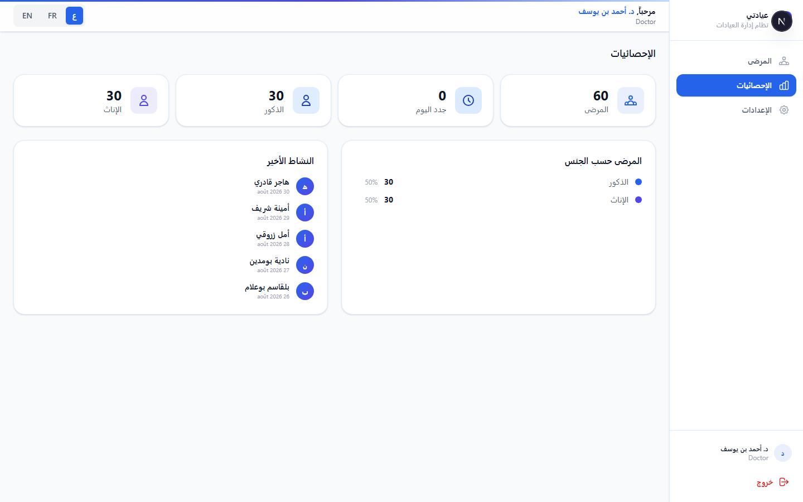
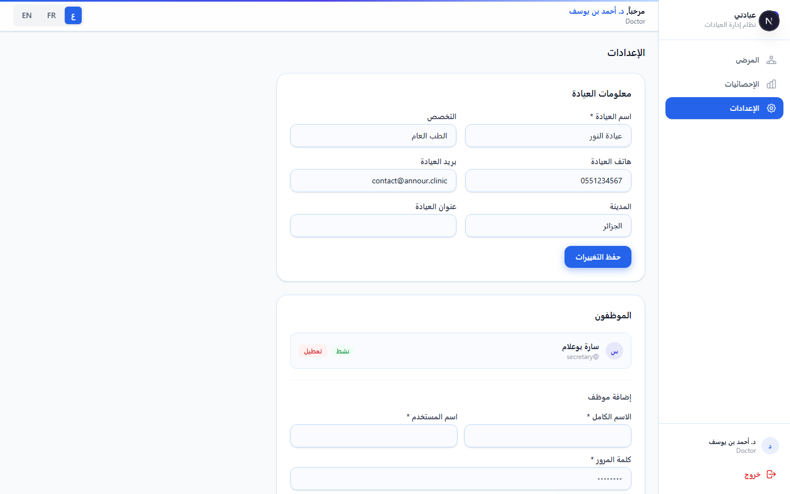

# MyClinic — Modern Clinic Management System

<div align="center">

**[English](#english) | [العربية](#العربية) | [Français](#français)**

</div>

---

# English

## What is MyClinic?

A professional, full-stack clinic management system built with modern web technologies. Manage patients, track pricing, view analytics, and handle your clinic's daily operations — all in a clean, bilingual (Arabic RTL + English + French) interface.

### Built With

| Technology | Version |
|------------|---------|
| Next.js | 16.3.3 |
| React | 19.2.4 |
| Supabase | @supabase/ssr 0.10.2 |
| Tailwind CSS | 4 |
| TypeScript | 5 |

---

## Screenshots

### Landing Page


### Registration


### Login


### Dashboard — Patients Tab


### Dashboard — Analytics Tab


### Dashboard — Settings Tab


---

## Demo Data

The system comes pre-seeded with real demo data for testing:

| Metric | Value |
|--------|-------|
| Clinics | 3 |
| Active Users | 5 |
| Patients | 60 |
| Appointments | 40 |
| Total Revenue | 257,500 DA |

### Demo Accounts

| Username | Password | Role |
|----------|----------|------|
| `doctor` | `doc123` | Doctor |
| `doctor2` | `doc2123` | Doctor |
| `secretary` | `sec123` | Secretary |

### Sample Patient Data

| Name | Phone | Gender | Medical Studies | Price (DA) | Registered |
|------|-------|--------|-----------------|------------|------------|
| هاجر قادري | 051002055 | Female | تخطيط القلب | 1,000 | 2026-08-30 |
| أمينة شريف | 051000685 | Female | — | 4,000 | 2026-08-29 |
| أمل زروقي | 051003151 | Female | — | 6,500 | 2026-08-28 |
| نادية بومدين | 051002877 | Female | تخطيط القلب | 2,500 | 2026-08-27 |
| بلقاسم بوعلام | 051005480 | Male | فحص ضغط الدم | 7,500 | 2026-08-26 |
| وائل لحمر | 051002466 | Male | تحاليل الدم | 4,000 | 2026-08-25 |

---

## Quick Start

```bash
# Clone and install
git clone https://github.com/oguenfoude/myclinic.git
cd myclinic
npm install

# Create .env.local with Supabase credentials
NEXT_PUBLIC_SUPABASE_URL=https://your-project.supabase.co
NEXT_PUBLIC_SUPABASE_PUBLISHABLE_KEY=eyJxxx...

# Run development server
npm run dev
```

Open [http://localhost:3000](http://localhost:3000)

---

## Features

| Feature | Description |
|---------|-------------|
| **Patient Management** | Add, edit, search, soft-delete patients with name, phone, gender, exams, and pricing |
| **Revenue Tracking** | Track patient pricing — view today's total, this week, this month, and all-time revenue |
| **Dashboard Analytics** | Gender split, recent activity, total patients — clean and simple |
| **Settings** | Manage clinic info, add/deactivate secretaries (doctor only) |
| **Multilingual** | Arabic (RTL), French, English — live switching with full translation |
| **RTL Layout** | Proper bidirectional layout support — Arabic reads right-to-left naturally |
| **Modern Auth UI** | Split-screen login/register with glassmorphism design |
| **Responsive** | Works on desktop, tablet, and mobile with adaptive sidebar/bottom nav |

---

## User Roles

| Role | Access |
|------|--------|
| **Doctor** | Full access: patients, analytics, settings, manage secretaries |
| **Secretary** | Patients only: add, edit, search, deactivate |

---

## Patient Data Model

| Field | Type | Required | Description |
|-------|------|----------|-------------|
| full_name | TEXT | Yes | Patient's full name |
| phone | TEXT | Yes | Contact phone number |
| gender | TEXT | | male / female |
| medical_studies | TEXT | | Free-text medical exams/studies |
| price | NUMERIC | | Consultation/treatment price (DA) |

---

## Project Structure

```
myclinic/
├── app/                        # Next.js App Router pages
│   ├── layout.tsx             # Root layout (RTL, metadata)
│   ├── page.tsx               # Landing page (marketing)
│   ├── login/page.tsx         # Login — split-screen design
│   ├── register/page.tsx      # Registration (2 fields)
│   └── dashboard/page.tsx     # Main app (patients + analytics + settings)
├── components/                 # Reusable React components
│   ├── Sidebar.tsx            # Navigation sidebar + mobile bottom nav
│   ├── PatientDialog.tsx      # Patient add/edit modal form
│   ├── LanguageSwitcher.tsx   # AR/FR/EN language toggle
│   ├── LoadingScreen.tsx      # Branded loading screen
│   └── Logo.tsx               # SVG logo component
├── lib/                       # Client utilities
│   ├── supabase.ts            # Supabase browser client
│   └── i18n.ts                # Translations (AR/FR/EN)
├── types/                     # TypeScript interfaces
│   └── index.ts               # Clinic, User, Patient, AuthUser
├── utils/                     # Server utilities
│   └── supabase/
│       ├── client.ts          # Browser client factory
│       ├── server.ts          # Server client factory
│       └── middleware.ts      # Session management
├── proxy.ts                   # Next.js 16 proxy (replaces middleware.ts)
├── DATABASE.md                # Complete database schema
├── AGENTS.md                  # Developer guidelines
├── tailwind.config.ts         # Tailwind theme tokens
└── package.json
```

---

## Available Commands

| Command | Description |
|---------|-------------|
| `npm run dev` | Start development server (Turbopack) |
| `npm run build` | Build for production |
| `npm run start` | Run production build |

---

## Database

The app uses 4 tables in Supabase:
- **clinics** — Clinic information (name, specialty, city, contact)
- **users** — Doctors and secretaries (role-based access, bcrypt passwords)
- **patients** — Patient records (name, phone, gender, exams, price)
- **appointments** — Scheduled/completed/cancelled appointments

See [DATABASE.md](./DATABASE.md) for complete schema and SQL.

---

## Authentication Flow

1. **Registration**: Doctor creates account → clinic + user inserted with bcrypt-hashed password → auto-login to dashboard.
2. **Login**: Username + password verified server-side via `app_login` RPC → session stored in `localStorage`.
3. **Session**: `AuthUser { id, clinic_id, full_name, role }` determines access level.
4. **Roles**: Doctor sees Patients + Analytics + Settings; Secretary sees Patients + Analytics only.

---

## Documentation

| File | Purpose |
|------|---------|
| `README.md` | This file — project overview |
| `DATABASE.md` | Database schema, SQL, TypeScript types |
| `AGENTS.md` | Developer guidelines and conventions |

---

# العربية

## ما هو MyClinic؟

نظام إدارة عيادات متكامل واحترافي مبني بأحدث تقنيات الويب. إدارة المرضى، تتبع الأسعار، عرض الإحصائيات، وإدارة العمليات اليومية لعيادتك — بكل واجهة ثنائية اللغة (العربية + الفرنسية + الإنجليزية).

### التقنيات

| التقنية | الإصدار |
|---------|---------|
| Next.js | 16.3.3 |
| React | 19.2.4 |
| Supabase | @supabase/ssr 0.10.2 |
| Tailwind CSS | 4 |
| TypeScript | 5 |

---

## لقطات الشاشة

### الصفحة الرئيسية


### التسجيل


### تسجيل الدخول


### لوحة التحكم — تبويب المرضى


### لوحة التحكم — تبويب الإحصائيات


### لوحة التحكم — تبويب الإعدادات


---

## البيانات التجريبية

| المقياس | القيمة |
|---------|--------|
| العيادات | 3 |
| المستخدمون النشطون | 5 |
| المرضى | 60 |
| المواعيد | 40 |
| إجمالي الإيرادات | 257,500 دج |

### حسابات التجربة

| اسم المستخدم | كلمة المرور | الدور |
|--------------|-------------|-------|
| `doctor` | `doc123` | طبيب |
| `doctor2` | `doc2123` | طبيب |
| `secretary` | `sec123` | سكرتير |

---

## البدء السريع

```bash
git clone https://github.com/oguenfoude/myclinic.git
cd myclinic
npm install
# أنشئ .env.local بمعلومات Supabase
npm run dev
```

افتح [http://localhost:3000](http://localhost:3000)

---

## المميزات

1. إدارة المرضى (إضافة، تعديل، بحث، تعطيل) مع الأسعار
2. تتبع الإيرادات (اليوم، هذا الأسبوع، هذا الشهر، الإجمالي)
3. إحصائيات لوحة التحكم (الجنس، النشاط الأخير، إجمالي المرضى)
4. إعدادات العيادة وإدارة الموظفين
5. متعدد اللغات (العربية، الفرنسية، الإنجليزية)
6. دعم RTL كامل — الواجهة العربية تقرأ من اليمين لليسار

---

## الأدوار

| الدور | الصلاحيات |
|-------|-----------|
| **طبيب** | كامل: المرضى، الإحصائيات، الإعدادات، إدارة الموظفين |
| **سكرتير** | المرضى + الإحصائيات فقط |

---

## نموذج بيانات المريض

| الحقل | النوع | مطلوب | الوصف |
|-------|-------|-------|-------|
| full_name | TEXT | نعم | اسم المريض الكامل |
| phone | TEXT | نعم | رقم الهاتف |
| gender | TEXT | | ذكر / أنثى |
| medical_studies | TEXT | | الفحوصات الطبية |
| price | NUMERIC | | سعر الاستشارة / العلاج (دج) |

---

# Français

## Qu'est-ce que MyClinic?

Système de gestion de clinique professionnel et complet construit avec les technologies web modernes. Gérez les patients, suivez les tarifs, consultez les statistiques et gérez les opérations quotidiennes de votre clinique — tout cela dans une interface bilingue (arabe RTL + anglais + français).

### Technologies

| Technologie | Version |
|-------------|---------|
| Next.js | 16.3.3 |
| React | 19.2.4 |
| Supabase | @supabase/ssr 0.10.2 |
| Tailwind CSS | 4 |
| TypeScript | 5 |

---

## Captures d'écran

### Page d'accueil


### Inscription


### Connexion


### Tableau de bord — Onglet Patients


### Tableau de bord — Onglet Statistiques


### Tableau de bord — Onglet Paramètres


---

## Données de démonstration

| Métrique | Valeur |
|----------|--------|
| Cliniques | 3 |
| Utilisateurs actifs | 5 |
| Patients | 60 |
| Rendez-vous | 40 |
| Revenus totaux | 257 500 DA |

### Comptes de démonstration

| Nom d'utilisateur | Mot de passe | Rôle |
|-------------------|-------------|------|
| `doctor` | `doc123` | Médecin |
| `doctor2` | `doc2123` | Médecin |
| `secretary` | `sec123` | Secrétaire |

---

## Démarrage Rapide

```bash
git clone https://github.com/oguenfoude/myclinic.git
cd myclinic
npm install
# Créer .env.local avec les identifiants Supabase
npm run dev
```

Ouvrez [http://localhost:3000](http://localhost:3000)

---

## Fonctionnalités

1. Gestion des patients (ajouter, modifier, rechercher, désactiver) avec tarifs
2. Suivi des revenus (aujourd'hui, cette semaine, ce mois-ci, total)
3. Statistiques du tableau de bord (sexe, activité récente, total patients)
4. Paramètres de la clinique et gestion du personnel
5. Multilingue (arabe, français, anglais)
6. Support RTL complet — l'interface arabe se lit de droite à gauche

---

## Rôles

| Rôle | Accès |
|------|-------|
| **Médecin** | Complet : patients, statistiques, paramètres, gestion personnel |
| **Secrétaire** | Patients + statistiques uniquement |

---

## Modèle de Données Patient

| Champ | Type | Obligatoire | Description |
|-------|------|-------------|-------------|
| full_name | TEXT | Oui | Nom complet du patient |
| phone | TEXT | Oui | Numéro de téléphone |
| gender | TEXT | | Homme / Femme |
| medical_studies | TEXT | | Examens médicaux (texte libre) |
| price | NUMERIC | | Tarif de consultation / traitement (DA) |
