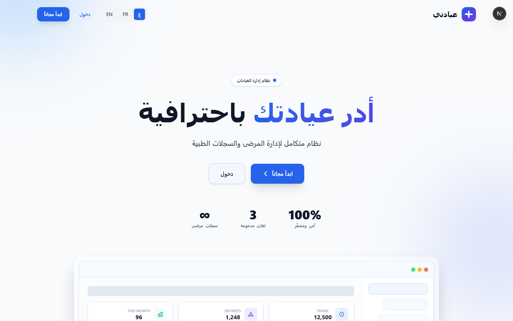
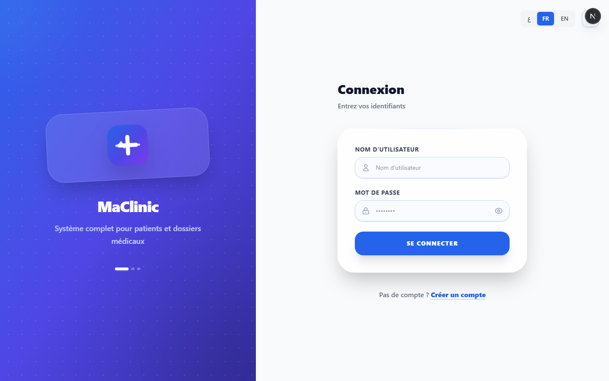
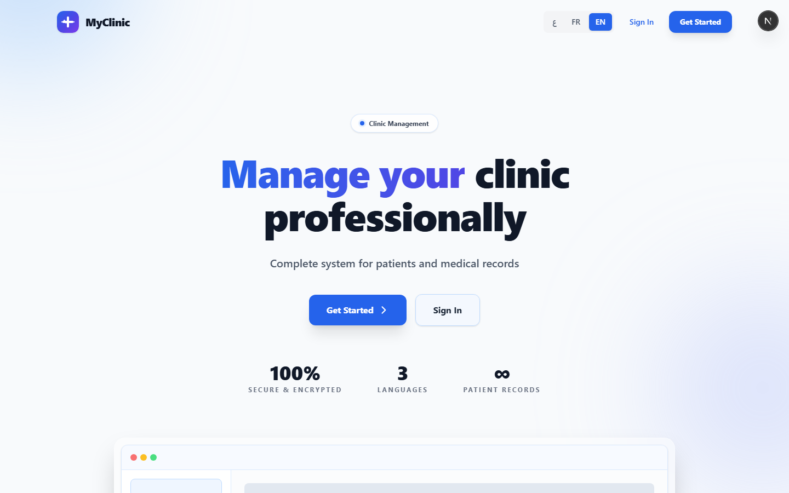
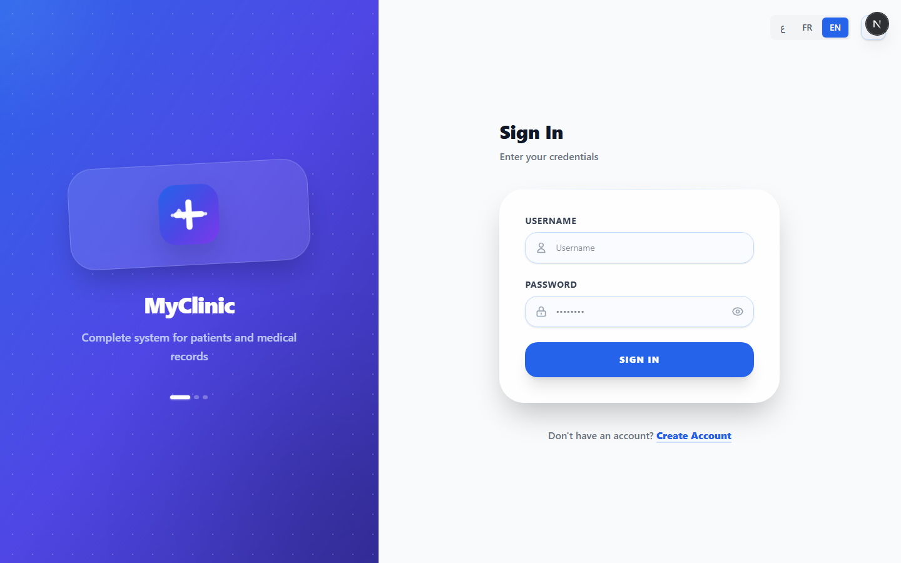

# MyClinic — Clinic Management System

<div align="center">

A professional clinic management system built with Next.js 16, Supabase, Tailwind CSS 4, and TypeScript.

**[English](#english) | [العربية](#العربية) | [Français](#français)**

</div>

---

# English

## Overview

MyClinic is a full-stack web application for managing medical clinics. It handles patient records, revenue tracking, analytics, and staff management — with full Arabic (RTL) support alongside French and English.

### Tech Stack

| Technology | Version |
|------------|---------|
| Next.js | 16.3.3 |
| React | 19.2.4 |
| Supabase | @supabase/ssr 0.10.2 |
| Tailwind CSS | 4 |
| TypeScript | 5 |

---

## Screenshots

### Arabic

| Landing | Dashboard | Analytics |
|---------|-----------|-----------|
|  |  |  |

### Français

| Accueil | Tableau de bord |
|---------|-----------------|
|  |  |

### English

| Landing | Login | Dashboard |
|---------|-------|-----------|
|  |  |  |

| Analytics | Settings |
|-----------|----------|
|  |  |

---

## Quick Start

```bash
git clone https://github.com/oguenfoude/myclinic.git
cd myclinic
npm install

# Create .env.local
NEXT_PUBLIC_SUPABASE_URL=https://your-project.supabase.co
NEXT_PUBLIC_SUPABASE_PUBLISHABLE_KEY=eyJxxx...

npm run dev
```

Open [http://localhost:3000](http://localhost:3000)

---

## Features

- **Patient Management** — Add, edit, search, soft-delete patients with name, phone, gender, exams, and pricing
- **Revenue Tracking** — Today, this week, this month, and all-time revenue totals on the dashboard
- **Analytics** — Gender split, recent activity, total patients — clean and simple
- **Settings** — Manage clinic info, add/deactivate secretaries (doctor only)
- **Multilingual** — Arabic (RTL), French, English — live switching
- **Responsive** — Desktop sidebar, mobile bottom nav, adaptive layouts
- **Secure Auth** — Bcrypt-hashed passwords, role-based access, server-side validation

---

## User Roles

| Role | Access |
|------|--------|
| **Doctor** | Patients, analytics, settings, manage secretaries |
| **Secretary** | Patients and analytics only |

---

## Patient Data Model

| Field | Type | Required | Description |
|-------|------|----------|-------------|
| `full_name` | TEXT | Yes | Patient's full name |
| `phone` | TEXT | Yes | Contact phone number |
| `gender` | TEXT | | male / female |
| `medical_studies` | TEXT | | Free-text medical exams/studies |
| `price` | NUMERIC | | Consultation/treatment price (DA) |

---

## Demo Data

| Metric | Value |
|--------|-------|
| Clinics | 3 |
| Active Users | 5 |
| Patients | 60 |
| Appointments | 40 |
| Total Revenue | 257,500 DA |

### Demo Accounts

| Username | Password | Role |
|----------|----------|------|
| `doctor` | `doc123` | Doctor |
| `doctor2` | `doc2123` | Doctor |
| `secretary` | `sec123` | Secretary |

---

## Database

4 tables in Supabase with Row Level Security:

- **clinics** — Clinic info (name, specialty, city, contact)
- **users** — Doctors and secretaries (bcrypt passwords, role-based)
- **patients** — Patient records (name, phone, gender, exams, price)
- **appointments** — Scheduled/completed/cancelled/no-show

See [DATABASE.md](./DATABASE.md) for complete schema.

---

## Project Structure

```
myclinic/
├── app/
│   ├── layout.tsx          # Root layout (RTL, metadata)
│   ├── page.tsx            # Landing page
│   ├── login/page.tsx      # Login
│   ├── register/page.tsx   # Registration
│   └── dashboard/page.tsx  # Main app (patients + analytics + settings)
├── components/
│   ├── Sidebar.tsx         # Navigation
│   ├── PatientDialog.tsx   # Patient add/edit
│   ├── LanguageSwitcher.tsx # AR/FR/EN toggle
│   ├── LoadingScreen.tsx   # Loading state
│   └── Logo.tsx            # Medical cross icon
├── lib/
│   ├── supabase.ts         # Browser client
│   └── i18n.ts             # Translations
├── types/index.ts          # TypeScript interfaces
├── proxy.ts                # Next.js 16 proxy
├── DATABASE.md             # Schema docs
└── AGENTS.md               # Dev guidelines
```

---

## Commands

| Command | Description |
|---------|-------------|
| `npm run dev` | Development server (Turbopack) |
| `npm run build` | Production build |
| `npm run start` | Run production server |

---

# العربية

## نظرة عامة

MyClinic نظام إدارة عيادات متكامل مبني بأحدث التقنيات. إدارة المرضى، تتبع الإيرادات، الإحصائيات، وإدارة الموظفين — مع دعم كامل للعربية (RTL) إلى جانب الفرنسية والإنجليزية.

### التقنيات

| التقنية | الإصدار |
|---------|---------|
| Next.js | 16.3.3 |
| React | 19.2.4 |
| Supabase | @supabase/ssr 0.10.2 |
| Tailwind CSS | 4 |
| TypeScript | 5 |

---

## لقطات الشاشة

### العربية

| الصفحة الرئيسية | لوحة التحكم | الإحصائيات |
|-----------------|-------------|------------|
|  |  |  |

### Français

| Accueil | Tableau de bord |
|---------|-----------------|
|  |  |

### English

| Landing | Login | Dashboard |
|---------|-------|-----------|
|  |  |  |

| Analytics | Settings |
|-----------|----------|
|  |  |

---

## البدء السريع

```bash
git clone https://github.com/oguenfoude/myclinic.git
cd myclinic
npm install
# أنشئ .env.local بمعلومات Supabase
npm run dev
```

افتح [http://localhost:3000](http://localhost:3000)

---

## المميزات

- إدارة المرضى (إضافة، تعديل، بحث، تعطيل) مع الأسعار
- تتبع الإيرادات (اليوم، هذا الأسبوع، هذا الشهر، الإجمالي)
- إحصائيات لوحة التحكم (الجنس، النشاط الأخير، إجمالي المرضى)
- إعدادات العيادة وإدارة الموظفين
- متعدد اللغات (العربية، الفرنسية، الإنجليزية)
- واجهة متجاوبة (شريط جانبي لل电脑، شريط سفلي للجوال)
- مصادقة آمنة (كلمات مرور مشفرة، أدوار محددة)

---

## الأدوار

| الدور | الصلاحيات |
|-------|-----------|
| **طبيب** | كامل: المرضى، الإحصائيات، الإعدادات، إدارة الموظفين |
| **سكرتير** | المرضى + الإحصائيات فقط |

---

## نموذج بيانات المريض

| الحقل | النوع | مطلوب | الوصف |
|-------|-------|-------|-------|
| `full_name` | TEXT | نعم | اسم المريض الكامل |
| `phone` | TEXT | نعم | رقم الهاتف |
| `gender` | TEXT | | ذكر / أنثى |
| `medical_studies` | TEXT | | الفحوصات الطبية |
| `price` | NUMERIC | | سعر الاستشارة / العلاج (دج) |

---

## البيانات التجريبية

| المقياس | القيمة |
|---------|--------|
| العيادات | 3 |
| المستخدمون النشطون | 5 |
| المرضى | 60 |
| المواعيد | 40 |
| إجمالي الإيرادات | 257,500 دج |

### حسابات التجربة

| اسم المستخدم | كلمة المرور | الدور |
|--------------|-------------|-------|
| `doctor` | `doc123` | طبيب |
| `doctor2` | `doc2123` | طبيب |
| `secretary` | `sec123` | سكرتير |

---

# Français

## Présentation

MyClinic est une application web complète de gestion de cliniques. Gestion des patients, suivi des revenus, statistiques et gestion du personnel — avec support complet de l'arabe (RTL) aux côtés du français et de l'anglais.

### Technologies

| Technologie | Version |
|-------------|---------|
| Next.js | 16.3.3 |
| React | 19.2.4 |
| Supabase | @supabase/ssr 0.10.2 |
| Tailwind CSS | 4 |
| TypeScript | 5 |

---

## Captures d'écran

### Français

| Accueil | Connexion | Tableau de bord |
|---------|-----------|-----------------|
|  |  |  |

### العربية

| الصفحة الرئيسية | لوحة التحكم | الإحصائيات |
|-----------------|-------------|------------|
|  |  |  |

### English

| Landing | Login | Dashboard |
|---------|-------|-----------|
|  |  |  |

| Analytics | Settings |
|-----------|----------|
|  |  |

---

## Démarrage Rapide

```bash
git clone https://github.com/oguenfoude/myclinic.git
cd myclinic
npm install
# Créer .env.local avec les identifiants Supabase
npm run dev
```

Ouvrez [http://localhost:3000](http://localhost:3000)

---

## Fonctionnalités

- Gestion des patients (ajouter, modifier, rechercher, désactiver) avec tarifs
- Suivi des revenus (aujourd'hui, cette semaine, ce mois-ci, total)
- Statistiques du tableau de bord (sexe, activité récente, total patients)
- Paramètres de la clinique et gestion du personnel
- Multilingue (arabe, français, anglais)
- Interface responsive (sidebar desktop, navigation mobile)
- Authentification sécurisée (mots de passe bcrypt, rôles)

---

## Rôles

| Rôle | Accès |
|------|-------|
| **Médecin** | Complet : patients, statistiques, paramètres, gestion personnel |
| **Secrétaire** | Patients et statistiques uniquement |

---

## Modèle de Données Patient

| Champ | Type | Obligatoire | Description |
|-------|------|-------------|-------------|
| `full_name` | TEXT | Oui | Nom complet du patient |
| `phone` | TEXT | Oui | Numéro de téléphone |
| `gender` | TEXT | | Homme / Femme |
| `medical_studies` | TEXT | | Examens médicaux (texte libre) |
| `price` | NUMERIC | | Tarif de consultation / traitement (DA) |

---

## Données de démonstration

| Métrique | Valeur |
|----------|--------|
| Cliniques | 3 |
| Utilisateurs actifs | 5 |
| Patients | 60 |
| Rendez-vous | 40 |
| Revenus totaux | 257 500 DA |

### Comptes de démonstration

| Nom d'utilisateur | Mot de passe | Rôle |
|-------------------|-------------|------|
| `doctor` | `doc123` | Médecin |
| `doctor2` | `doc2123` | Médecin |
| `secretary` | `sec123` | Secrétaire |
